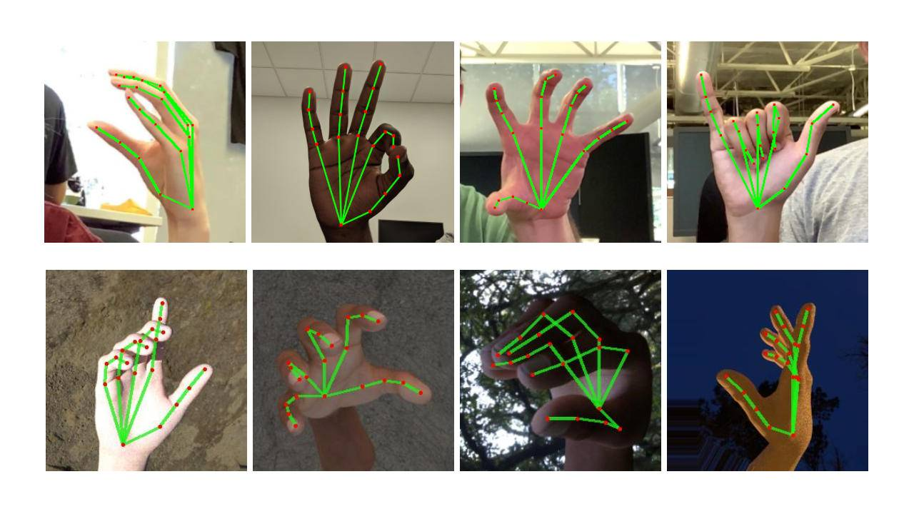

# Gesture-Volume-Control

<div align="center">
  
 </div>

> This Project uses OpenCV and MediaPipe to Control system volume 

## 💾 REQUIREMENTS
+ opencv-python
+ mediapipe
+ osascript
+ numpy

```bash
pip install -r requirements.txt
```
***
### MEDIAPIPE
<div align="center">
  
</div>

> MediaPipe offers open source cross-platform, customizable ML solutions for live and streaming media.

#### Hand Landmark Model
After the palm detection over the whole image our subsequent hand landmark model performs precise keypoint localization of 21 3D hand-knuckle coordinates inside the detected hand regions via regression, that is direct coordinate prediction. The model learns a consistent internal hand pose representation and is robust even to partially visible hands and self-occlusions.

To obtain ground truth data, we have manually annotated ~30K real-world images with 21 3D coordinates, as shown below (we take Z-value from image depth map, if it exists per corresponding coordinate). To better cover the possible hand poses and provide additional supervision on the nature of hand geometry, we also render a high-quality synthetic hand model over various backgrounds and map it to the corresponding 3D coordinates.<br>

#### Solution APIs
##### Configuration Options
> Naming style and availability may differ slightly across platforms/languages.

+ <b>STATIC_IMAGE_MODE</b><br>
If set to false, the solution treats the input images as a video stream. It will try to detect hands in the first input images, and upon a successful detection further localizes the hand landmarks. In subsequent images, once all max_num_hands hands are detected and the corresponding hand landmarks are localized, it simply tracks those landmarks without invoking another detection until it loses track of any of the hands. This reduces latency and is ideal for processing video frames. If set to true, hand detection runs on every input image, ideal for processing a batch of static, possibly unrelated, images. Default to false.

+ <b>MAX_NUM_HANDS</b><br>
Maximum number of hands to detect. Default to 2.

+ <b>MODEL_COMPLEXITY</b><br>
Complexity of the hand landmark model: 0 or 1. Landmark accuracy as well as inference latency generally go up with the model complexity. Default to 1.

+ <b>MIN_DETECTION_CONFIDENCE</b><br>
Minimum confidence value ([0.0, 1.0]) from the hand detection model for the detection to be considered successful. Default to 0.5.

+ <b>MIN_TRACKING_CONFIDENCE:</b><br>
Minimum confidence value ([0.0, 1.0]) from the landmark-tracking model for the hand landmarks to be considered tracked successfully, or otherwise hand detection will be invoked automatically on the next input image. Setting it to a higher value can increase robustness of the solution, at the expense of a higher latency. Ignored if static_image_mode is true, where hand detection simply runs on every image. Default to 0.5.

<br>

Source: [MediaPipe Hands Solutions](https://google.github.io/mediapipe/solutions/hands#python-solution-api)

<div align="center">
    
    
    
</div>


## 📝 CODE EXPLANATION
<b>Importing Libraries</b>
```py
import numpy as np
import mediapipe as mp
import cv2
import math
import osascript
```
***
Solution APIs Usage
```py
draw = mp.solutions.drawing_utils
drawstyle = mp.solutions.drawing_styles
hand = mp.solutions.hands
hands = hand.Hands(model_complexity=0,min_detection_confidence=0.6,min_tracking_confidence=0.6)
```
***

Webcam Setup
```py
cam = cv2.VideoCapture(0)
cam.set(3,640)
cam.set(4,480)
```
***
Mediapipe Landmark Model Using OpenCV
```py
while True:
  ret,frame = cam.read()
  rgbframe = cv2.cvtColor(frame,cv2.COLOR_BGR2RGB)
  op = hands.process(rgbframe)
  if op.multi_hand_landmarks:
    for i in op.multi_hand_landmarks:
      print(i)
      draw.draw_landmarks(
          frame,
          i,
          hand.HAND_CONNECTIONS,
          landmark_drawing_spec=draw.DrawingSpec(color = (0,255,0),circle_radius = 1)
        )
```
***
Finding Position of Hand Ladmarks
```py
for id, lm in enumerate(op.multi_hand_landmarks[0].landmark):
    h, w, _ = frame.shape
    lmlist.append([id,int(lm.x*w),int(lm.y*h)])
   
```
***
Assigning variables for Thumb and Index finger position
```py
 if len(lmlist)!=0:
    x1, y1 = lmlist[4][1], lmlist[4][2]
    x2, y2 = lmlist[8][1], lmlist[8][2]
    length = math.hypot(x1 - x2, y1 - y2)
```
***
Marking Thumb Tip and Index Tip
```py
cv2.circle(frame, (x1, y1), 15, (255, 255, 255))
cv2.circle(frame, (x2, y2), 15, (255, 255, 255))
if(length > 50):
    cv2.line(frame,(x1, y1), (x2, y2), (0, 255, 0), 3)
else:
    cv2.line(frame,(x1, y1), (x2, y2), (0, 0, 255), 3)
```
***
Calculating Volume with Reference to Length
```py
vol = np.interp(length, [50, 220], [0, 100])

```
***
Set the Volume Level
```py
osascript.osascript("set volume output volume {}".format(vol))
volbar = np.interp(length, [50, 220], [400, 150])
volper = np.interp(length, [50, 220], [0, 100])
```
***
Creating Volume Bar
```py
cv2.rectangle(frame, (50, 150), (80, 400), (0, 0, 0), 3)
cv2.rectangle(frame, (50, int(volbar)), (80, 400), (0, 0, 0), -1)
cv2.putText(frame, f'{int(volper)} %', (40, 450), cv2.FONT_HERSHEY_COMPLEX, 1, (0, 0 ,0), 3)
```
***
Displaying the Result
```py
cv2.imshow("Controller", frame)
```
***
Exit
```py
if cv2.waitKey(1) == ord('q'):
  break
```
***

Releasing Camera and Destroying Window
```py
cam.release()
cv2.destroyAllWindows()
```
***

<div align = "center">
<h2>📬 Contact</h2>

If you want to contact me, you can reach me through below handle.

<a href="https://www.linkedin.com/in/akshat-manihar/"> Akshat Manihar</img></a>

</div>